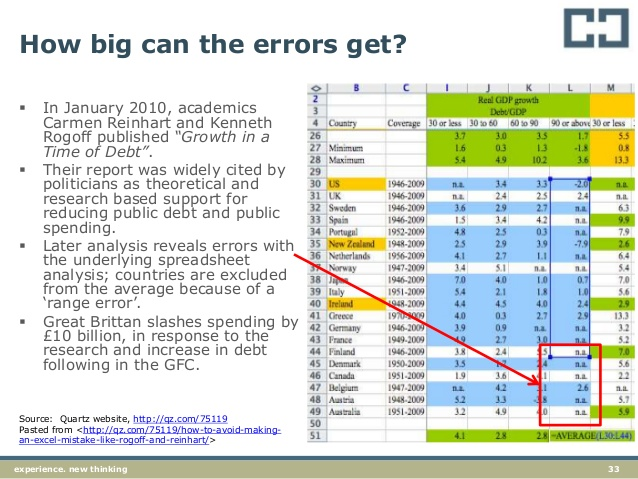
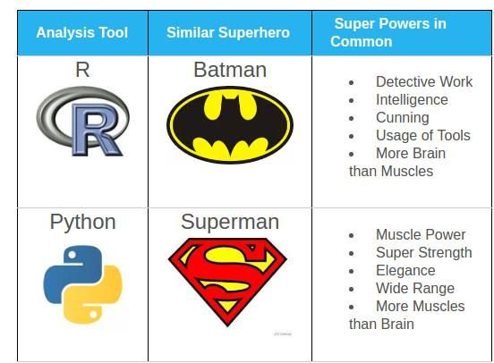
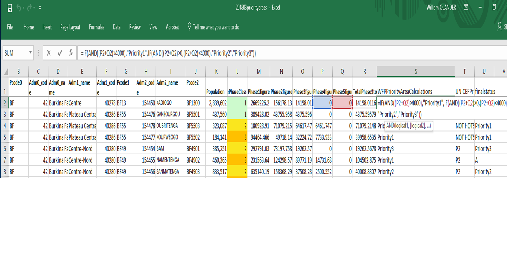

```{r message=FALSE, warning = FALSE, echo = FALSE}
knitr::opts_chunk$set(warning = FALSE, message = FALSE, fig.width = 12, fig.height = 4)
```

---
class: center, middle, inverse
## What is humanitarian data science ?

---
## Data science
.center[]

---
## Humanitarian data scientist
.center[]

---
class: center, middle, inverse
## Why humanitarian data science ?

---
## Analysis is often slow and costly (license and staff)
.center[]

---
## Analysis is often error prone and not reproducible: 
_we all know about these type of errors_
.center[]

---
## We could do better 
[callum taylor's analysis of Cholera in Yemen](https://callumgwtaylor.github.io/blog/2017/12/16/yemen-cholera-update-december/) 


---
class: center, middle, inverse
## Grammar of data manipulation and graphics

---
## Grammar of data manipulation and graphics with R
.center[]

---
## Why R ?

 - `R` is open source and free
 - `R` has a enthusiastic (bordering on fanatic) community 
 - `R` has around 12000 packages (add-ons) and anyone can create/publish a package
 - Batman is cooler than Superman
.center[]

---
## Grammar of data manipulation and graphics

```{r}
library(dplyr)
library(readxl)
data <- read_excel(path = "data/data.xlsx", sheet = 1)
data
```	


---
## Grammar of data manipulation and graphics

```{r}
data %>%
  mutate(taille_metre = taille / 100,
         imc = poids / (taille_metre^2)) %>%
  arrange(desc(imc))
```


---
## Grammar of data manipulation and graphics: WFP dataset from Guinea
_explore: which enumerators might have skipped questions?_

```{r}
library(ggplot2)

guinea_data <- read_excel(path = "data/guinea_data.xlsx", sheet = 1)

qplot(Q03, uwFCS, data=guinea_data, geom=c("boxplot", "jitter"), color=Q03)

```


---
## Grammar of data manipulation and graphics: WFP dataset from Guinea
_explore and filter: Kérouané prefecture in Kankan looks suspicious..._

```{r}

guinea_data %>% filter(Q03=="Kankan" & Q04=="Kérouané") %>% ggplot(aes(x=Code_enqueteur_menage, y=uwFCS, color=Code_enqueteur_menage)) + geom_boxplot() + geom_jitter()

```


---
## Grammar of data manipulation and graphics: WFP dataset from Guinea
_anonymize: maybe it's not cool to show the name of the enumerators..._

```{r}

library(anonymizer)

guinea_data %>% filter(Q03=="Kankan" & Q04=="Kérouané") %>% mutate(enqueter_anon = anonymize(Code_enqueteur_menage, .algo = "crc32")) %>% ggplot(aes(x=enqueter_anon, y=uwFCS, color=enqueter_anon)) + geom_boxplot() + geom_jitter()

```


---
## Don't fear the code
_we're already doing it_
.center[]


---
class: center, middle, inverse
## Building a Massive Open Online Course


---
## Data Camp's Course Editor 
Advantages:
1. Free
2. Easy to build content
3. Teaching models 
4. Reproducible


[data camp course editor](https://authoring.datacamp.com/)


---
class: center, middle, inverse
## Demo


---
## Demo Course 
[Data Science for HumanitaRians - Quick & Dirty Data Visualization with Qplot](https://www.datacamp.com/courses/7692)


---
## Main activities and timeline

#### Develop core [curriculum](https://docs.google.com/document/d/1ztVle5UL7TPJXh9v5amzKxRhEutRf4WqhdnCuaR7kwc/edit#)

#### Organize a 1 week "sprint" session inviting core contributors (HDX, WFP, UNHCR) to build the skeleton and muscles of the course.

#### Test out content with large pool of IMOS, for example CartONG's GEONG conference.

#### Refine content with support from DataCamp and possibly RStudio.

#### Launch content online by end of 2018 advertise to users but also advertise so that content can be expanded/translated.


---
class: center, middle, inverse
## Questions?

<!-- [dicko5@un.org](mailto:dicko5@un.org) -->

<!-- [dickoa.gitlab.io](http://dickoa.gitlab.io) -->

